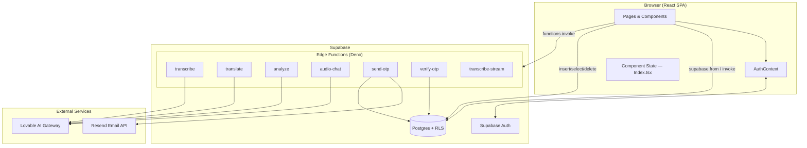

# Devowl Transcriptor — Project Documentation

> Production-grade technical documentation for the **Devowl Transcriptor** codebase.  
> All descriptions are grounded in the actual source code as of June 2026.

---

## Table of Contents

1. [Project Overview](#1-project-overview)
2. [Tech Stack](#2-tech-stack)
3. [Architecture & System Design](#3-architecture--system-design)
4. [Project Structure](#4-project-structure)
5. [Features (Detailed)](#5-features-detailed)
6. [API Reference](#6-api-reference)
7. [Database / Data Models](#7-database--data-models)
8. [Authentication & Authorization](#8-authentication--authorization)
9. [State Management & Data Flow](#9-state-management--data-flow)
10. [Environment Variables & Configuration](#10-environment-variables--configuration)
11. [Installation & Local Setup](#11-installation--local-setup)
12. [Deployment](#12-deployment)
13. [Known Issues / Limitations](#13-known-issues--limitations)
14. [Future Improvements](#14-future-improvements)

---

## 1. Project Overview

### What This Project Does

**Devowl Transcriptor** is a full-stack web application that lets authenticated users upload or record audio, receive AI-generated transcriptions in the original language (written in native script), get fluent English translations, view structured AI analysis (summaries, action items, deadlines, etc.), and chat with an AI assistant about each recording. All results are persisted per user and accessible from a history sidebar.

### Core Problem It Solves

Manual transcription and translation of audio is slow and error-prone. This app automates the pipeline—transcribe → translate → analyze → discuss—so users can quickly turn spoken content (meetings, interviews, voice notes) into searchable, actionable text without leaving the browser.

### Target Users & Use Cases

| User / Use Case | How the app helps |
|---|---|
| Professionals reviewing meetings | Structured analysis extracts action items, deadlines, and key decisions |
| Multilingual speakers | Native-script transcription plus English translation |
| Researchers / journalists | Upload audio files (MP3, WAV, etc.) and download combined `.txt` exports |
| On-the-go note-takers | Live browser recording via Web Speech API, then translation and analysis |
| Returning users | History sidebar stores up to 50 recent transcriptions with chat continuity |

---

## 2. Tech Stack

### Languages & Runtimes

| Technology | Role |
|---|---|
| **TypeScript** | Frontend (React) and Supabase Edge Functions (Deno) |
| **SQL** | Postgres schema via Supabase migrations |
| **HTML/CSS** | Email templates, static shell (`index.html`) |

### Frontend

| Library / Tool | Version (from `package.json`) | Purpose |
|---|---|---|
| **React** | ^18.3.1 | UI framework |
| **Vite** | ^5.4.19 | Dev server & production bundler (port `8080`) |
| **React Router DOM** | ^6.30.1 | Client-side routing |
| **Tailwind CSS** | ^3.4.17 | Utility-first styling |
| **shadcn/ui + Radix UI** | Various `@radix-ui/*` | Accessible component primitives |
| **TanStack React Query** | ^5.83.0 | Server-state provider (instantiated; minimal direct usage) |
| **Supabase JS** | ^2.95.3 | Auth, database, edge function invocations |
| **next-themes** | ^0.3.0 | Light/dark theme toggle |
| **react-markdown + remark-gfm** | ^10.1.0 / ^4.0.1 | Render AI chat responses |
| **lucide-react** | ^0.462.0 | Icons |
| **Vitest + Testing Library** | ^3.2.4 | Unit testing scaffold |

### Backend & Infrastructure

| Technology | Purpose |
|---|---|
| **Supabase Postgres** | Persistent storage with Row Level Security (RLS) |
| **Supabase Auth** | Email/password and native OTP sign-in |
| **Supabase Edge Functions (Deno)** | Serverless AI proxy and OTP helpers |
| **Lovable AI Gateway** | Routes requests to Gemini and OpenAI transcription models |
| **Resend** | Sends custom signup verification emails (`send-otp`) |
| **Vercel** | Frontend hosting (per README badge); `api/keep-alive.ts` serverless route |
| **GitHub Actions** | Daily Supabase ping to prevent free-tier project pause |

### Why These Choices (Inferred from Code)

- **Vite + React**: Fast local development, ESM-native, SWC plugin for quick builds.
- **Supabase**: Single platform for auth, Postgres, RLS, and edge functions—reduces backend boilerplate.
- **shadcn/ui**: Copy-paste components (`components.json`) give full control without a heavy component library lock-in.
- **Edge Functions + Lovable Gateway**: Keeps `LOVABLE_API_KEY` server-side; frontend never sees AI credentials.
- **Gemini multimodal models**: `transcribe` sends audio as `input_audio` to `google/gemini-2.5-flash`.
- **Web Speech API for live recording**: Avoids server round-trips during capture; only translation/analysis hit the backend.

---

## 3. Architecture & System Design

### High-Level Architecture



### Pattern

- **Single-page application (SPA)** with **Backend-as-a-Service (BaaS)** — not microservices.
- **Layered frontend**: routes (`pages/`) → feature components (`components/`) → UI primitives (`components/ui/`) → integrations (`integrations/supabase/`).
- **Serverless API layer**: each Supabase Edge Function is an independent HTTP handler.
- **Security boundary**: Postgres RLS enforces per-user data access; edge functions hold service-role keys only where needed (`send-otp`, `verify-otp`).

### Data Flow: Upload → Output

```
1. User selects audio file (AudioUploadZone)
      ↓ validateAudioFile() — type + 25MB limit
2. fileToBase64() — strip data-URL prefix
      ↓
3. supabase.functions.invoke("transcribe", { audioBase64, mimeType, fileName })
      ↓ Gemini 2.5 Flash — returns "[Language: X]\n\n<text>"
4. Frontend parses [Language: ...] tag, strips it from transcription text
      ↓
5. supabase.functions.invoke("translate", { text, detectedLanguage })
      ↓ Gemini 3 Flash Preview — English translation or cleanup
6. supabase.functions.invoke("analyze", { text })
      ↓ Gemini 2.5 Flash + tool calling — structured JSON analysis
7. supabase.from("transcriptions").insert({ ... analysis as jsonb })
      ↓
8. UI renders ResultsPane + AnalysisPane + AudioChat (after save)
```

**Live recording path** skips step 3: `LiveRecorder` uses the browser Web Speech API, then enters at step 5 with the captured text.

### Module Interaction Summary

| Layer | Responsibility | Key Files |
|---|---|---|
| Routing | URL → page mapping, auth gate | `src/App.tsx`, `ProtectedRoute.tsx` |
| Dashboard orchestration | Pipeline state machine, history CRUD | `src/pages/Index.tsx` |
| Auth session | Supabase session subscription | `src/contexts/AuthContext.tsx` |
| AI proxy | Model calls, error mapping | `supabase/functions/*/index.ts` |
| Persistence | Schema, RLS, indexes | `supabase/migrations/*.sql` |

---

## 4. Project Structure

```
speak-translate/
├── api/
│   └── keep-alive.ts              # Vercel serverless health check for Supabase DB
├── .github/workflows/
│   └── keep-alive.yml             # Cron job pinging Supabase REST API daily
├── public/
│   ├── owl-favicon.svg            # Primary favicon (also in index.html)
│   ├── owl-favicon.png            # Used in some auth/history UI images
│   ├── favicon.ico
│   ├── placeholder.svg
│   └── robots.txt
├── src/
│   ├── main.tsx                   # React entry; ThemeProvider wrapper
│   ├── App.tsx                    # Router, providers, route definitions
│   ├── index.css                  # Tailwind directives + CSS variables
│   ├── App.css                    # Legacy/minimal app styles
│   ├── vite-env.d.ts              # Vite client type references
│   ├── components/
│   │   ├── AnalysisPane.tsx       # Renders structured AI analysis cards
│   │   ├── AudioChat.tsx          # Slide-over chat UI + message persistence
│   │   ├── AudioUploadZone.tsx    # Drag-and-drop / file picker for audio
│   │   ├── HistorySidebar.tsx     # Collapsible sidebar with transcription history
│   │   ├── LiveRecorder.tsx       # Web Speech API live recording
│   │   ├── ProcessingStatus.tsx   # Step indicator (upload → transcribe → translate)
│   │   ├── ProtectedRoute.tsx     # Redirects unauthenticated users to /login
│   │   ├── ResultsPane.tsx        # Transcription + translation display, copy/download
│   │   ├── ThemeToggle.tsx        # Light/dark mode button
│   │   ├── TranscriptionHistory.tsx  # Legacy card-based history (unused in Index)
│   │   ├── PasswordInput.tsx      # Password field with visibility toggle
│   │   ├── NavLink.tsx            # Router NavLink wrapper
│   │   └── ui/                    # shadcn/ui primitives (~40 components)
│   ├── contexts/
│   │   └── AuthContext.tsx        # Supabase auth state provider
│   ├── hooks/
│   │   ├── use-toast.ts           # Toast notification hook
│   │   └── use-mobile.tsx         # Responsive breakpoint hook
│   ├── integrations/supabase/
│   │   ├── client.ts              # Typed Supabase client (requires env vars)
│   │   └── types.ts               # Generated Database TypeScript types
│   ├── lib/
│   │   ├── audio-utils.ts         # File validation, base64 encoding, size formatting
│   │   └── utils.ts               # cn() — clsx + tailwind-merge helper
│   ├── pages/
│   │   ├── Index.tsx              # Main dashboard (protected)
│   │   ├── Login.tsx              # Email/password login
│   │   ├── Signup.tsx             # Registration with display name
│   │   ├── ForgotPassword.tsx     # Password reset email trigger
│   │   ├── ResetPassword.tsx      # Set new password after email link
│   │   ├── VerifyOTP.tsx          # Supabase native email OTP login
│   │   ├── VerifySignup.tsx       # Custom Resend OTP verification (NOT routed)
│   │   └── NotFound.tsx           # 404 page
│   └── test/
│       ├── setup.ts               # Vitest DOM setup
│       └── example.test.ts        # Placeholder test
├── supabase/
│   ├── config.toml                # Project ID, function JWT settings, email templates
│   ├── functions/
│   │   ├── transcribe/index.ts    # Gemini multimodal transcription
│   │   ├── translate/index.ts     # Gemini English translation/cleanup
│   │   ├── analyze/index.ts       # Gemini structured analysis via tool calling
│   │   ├── audio-chat/index.ts    # Contextual Q&A about a transcription
│   │   ├── transcribe-stream/index.ts  # Streaming STT (not used by frontend)
│   │   ├── send-otp/index.ts      # Generate + email 6-digit code via Resend
│   │   └── verify-otp/index.ts    # Validate custom OTP codes
│   ├── migrations/                # Ordered SQL schema migrations
│   └── templates/                 # Supabase auth email HTML templates
├── index.html                     # SPA shell + meta tags
├── package.json                   # Scripts and dependencies
├── vite.config.ts                 # Dev server port 8080, @ alias, lovable-tagger
├── tailwind.config.ts             # Theme extension, typography plugin
├── tsconfig*.json                 # TypeScript project references
├── vitest.config.ts               # Test runner configuration
├── eslint.config.js               # ESLint flat config
├── postcss.config.js              # Tailwind + Autoprefixer
├── components.json                # shadcn/ui configuration
└── README.md                      # Shorter project README (partial env docs)
```

---

## 5. Features (Detailed)

### 5.1 Audio File Upload & Transcription

| Aspect | Detail |
|---|---|
| **What it does** | Accepts audio files, transcribes them via AI in the original language (native script). |
| **User experience** | Drag-and-drop or click-to-browse zone; supported formats shown as MP3, WAV, M4A, OGG, FLAC up to 25MB. |
| **Internal flow** | `AudioUploadZone` → `validateAudioFile()` → `fileToBase64()` → `transcribe` edge function. |
| **Key files** | `src/components/AudioUploadZone.tsx`, `src/lib/audio-utils.ts`, `supabase/functions/transcribe/index.ts`, `src/pages/Index.tsx` (`processAudio`) |

The transcribe function uses **Gemini 2.5 Flash** with a system prompt requiring `[Language: <name>]` prefix and native-script output. Audio format is sent as `wav` or `mp3` based on MIME type.

### 5.2 English Translation / Cleanup

| Aspect | Detail |
|---|---|
| **What it does** | Translates non-English transcription to fluent English; cleans grammar if already English. |
| **User experience** | Shown in the right column of `ResultsPane`; English sources show an italic note instead of duplicate text. |
| **Internal flow** | After transcription, `translate` is invoked with `{ text, detectedLanguage }`. Returns `{ translation, isEnglish }`. |
| **Key files** | `supabase/functions/translate/index.ts`, `src/components/ResultsPane.tsx`, `src/pages/Index.tsx` |

Model: **Gemini 3 Flash Preview** via Lovable Gateway.

### 5.3 Live Browser Recording

| Aspect | Detail |
|---|---|
| **What it does** | Records speech in-browser using Web Speech API; skips server-side transcription. |
| **User experience** | Mic button with waveform visualization, elapsed timer, live interim/final text preview. |
| **Internal flow** | `LiveRecorder` → `onTranscriptComplete({ text, fileName })` → `processRecordedText()` → translate → analyze → save. |
| **Key files** | `src/components/LiveRecorder.tsx`, `src/pages/Index.tsx` |

**Browser requirement**: Chrome, Edge, or Safari (explicit unsupported message for other browsers).

### 5.4 AI Structured Analysis

| Aspect | Detail |
|---|---|
| **What it does** | Produces summary, detailed notes, action items, deadlines, decisions, highlights, follow-ups, and optional speaker breakdown. |
| **User experience** | Grid of cards below results; loading spinner while generating; empty sections show "Nothing detected." |
| **Internal flow** | `analyze` edge function uses Gemini tool calling (`return_analysis` function schema) → stored as `jsonb` on `transcriptions.analysis`. |
| **Key files** | `supabase/functions/analyze/index.ts`, `src/components/AnalysisPane.tsx`, `src/pages/Index.tsx` (`runAnalysisAndSave`) |

Analysis runs on English text: translation if non-English, otherwise the cleaned transcription.

### 5.5 Transcription History

| Aspect | Detail |
|---|---|
| **What it does** | Lists user's past transcriptions; select to reload; delete to remove. |
| **User experience** | Left sidebar with file name, language, date; hover delete icon; "New Transcription" button resets the dashboard. |
| **Internal flow** | `fetchHistory()` selects last 50 records ordered by `created_at DESC`. RLS ensures user-scoped access. |
| **Key files** | `src/components/HistorySidebar.tsx`, `src/pages/Index.tsx` |

### 5.6 Results Export & Copy

| Aspect | Detail |
|---|---|
| **What it does** | Copy transcription/translation to clipboard; download combined `.txt` file. |
| **User experience** | Copy buttons per card; download button exports both sections with language header. |
| **Key files** | `src/components/ResultsPane.tsx` |

### 5.7 AI Chat About Audio

| Aspect | Detail |
|---|---|
| **What it does** | Conversational Q&A grounded in transcript, translation, and prior analysis. |
| **User experience** | Floating "Chat with Audio" button opens a right sheet; suggestion chips; markdown-rendered replies. |
| **Internal flow** | Messages loaded from `audio_chat_messages` → user message persisted → `audio-chat` function → assistant reply persisted. |
| **Key files** | `src/components/AudioChat.tsx`, `supabase/functions/audio-chat/index.ts`, migration `20260623053533_*.sql` |

Only available after a transcription is saved (`activeHistoryId` is set).

### 5.8 Authentication

| Feature | Route | Mechanism |
|---|---|---|
| Email/password login | `/login` | `supabase.auth.signInWithPassword` |
| Registration | `/signup` | `supabase.auth.signUp` with `display_name` metadata |
| Password reset request | `/forgot-password` | `supabase.auth.resetPasswordForEmail` |
| Password reset completion | `/reset-password` | `supabase.auth.updateUser({ password })` |
| OTP login | `/verify-otp` | `signInWithOtp` + `verifyOtp` (Supabase native) |
| Custom signup OTP | `/verify-signup` (page exists, **not routed**) | `send-otp` / `verify-otp` edge functions + Resend |

### 5.9 Theme Toggle

| Aspect | Detail |
|---|---|
| **What it does** | Switches between light and dark themes. |
| **Key files** | `src/components/ThemeToggle.tsx`, `src/main.tsx` (`ThemeProvider`, `defaultTheme="light"`) |

### 5.10 Processing Status Indicator

| Aspect | Detail |
|---|---|
| **What it does** | Visual stepper: Uploading → Transcribing → Translating → Done. |
| **Key files** | `src/components/ProcessingStatus.tsx` |

Steps `"idle"` and `"done"` hide the indicator; `"error"` shows a red message.

### 5.11 Keep-Alive / Health Monitoring

| Aspect | Detail |
|---|---|
| **What it does** | Prevents Supabase free-tier project from pausing due to inactivity. |
| **Mechanisms** | GitHub Actions cron (`0 12 * * *` UTC) pings REST API; Vercel `GET /api/keep-alive` queries `profiles` table. |
| **Key files** | `.github/workflows/keep-alive.yml`, `api/keep-alive.ts` |

---

## 6. API Reference

### 6.1 Frontend Routes (React Router)

| Method | Route | Auth Required | Component | Description |
|---|---|---|---|---|
| GET | `/` | Yes | `Index` | Main transcription dashboard |
| GET | `/login` | No | `Login` | Email/password sign-in |
| GET | `/signup` | No | `Signup` | Account creation |
| GET | `/forgot-password` | No | `ForgotPassword` | Request reset email |
| GET | `/reset-password` | No* | `ResetPassword` | Set new password (*requires valid session from email link) |
| GET | `/verify-otp` | No | `VerifyOTP` | Email OTP sign-in |
| GET | `*` | No | `NotFound` | 404 fallback |

### 6.2 Supabase Edge Functions

All functions accept `POST` with JSON body (except `transcribe-stream`). All return JSON unless noted. CORS headers allow `*`. JWT verification is **disabled** in `supabase/config.toml` for `transcribe`, `translate`, `send-otp`, and `verify-otp` (see [§13](#13-known-issues--limitations)).

#### `POST /functions/v1/transcribe`

**Request body:**

```json
{
  "audioBase64": "<base64 string without data-URL prefix>",
  "mimeType": "audio/mpeg",
  "fileName": "recording.mp3"
}
```

**Success response (200):**

```json
{ "transcription": "[Language: Urdu]\n\n<transcribed text>" }
```

**Error responses:**

| Status | Body |
|---|---|
| 400 | `{ "error": "Missing audio data or mime type" }` |
| 402 | `{ "error": "Usage limit reached. Please add credits to continue." }` |
| 429 | `{ "error": "Rate limit exceeded. Please try again in a moment." }` |
| 500 | `{ "error": "Transcription failed. Please try again." }` or exception message |

**Auth:** None enforced at edge (relies on Supabase anon key for invoke).

---

#### `POST /functions/v1/translate`

**Request body:**

```json
{
  "text": "transcribed text",
  "detectedLanguage": "Urdu"
}
```

**Success response (200):**

```json
{
  "translation": "English translation text",
  "isEnglish": false
}
```

**Error responses:** Same 400/402/429/500 pattern as transcribe.

**Note:** Does not return `detectedLanguage`, though `Index.tsx` reads `translateData.detectedLanguage` for live recordings (always falls back to `"Unknown"`).

---

#### `POST /functions/v1/analyze`

**Request body:**

```json
{ "text": "English transcript text" }
```

**Success response (200):**

```json
{
  "analysis": {
    "summary": "...",
    "detailed_notes": ["..."],
    "action_items": [{ "task": "...", "assignee": "...", "deadline": "..." }],
    "deadlines": [{ "when": "...", "what": "..." }],
    "key_decisions": ["..."],
    "important_points": ["..."],
    "highlights": ["..."],
    "follow_ups": ["..."],
    "speaker_analysis": [{ "speaker": "...", "contribution": "..." }]
  }
}
```

**Error responses:** 400 (missing text), 402, 429, 500.

---

#### `POST /functions/v1/audio-chat`

**Request body:**

```json
{
  "messages": [{ "role": "user", "content": "Summarize the key points" }],
  "transcription": "original text",
  "translation": "english text",
  "analysis": { "...": "..." },
  "fileName": "meeting.mp3"
}
```

**Success response (200):**

```json
{ "reply": "Markdown-formatted assistant response" }
```

**Error responses:** 400 (missing messages), 402, 429, 500.

**Auth header note:** Uses `Lovable-API-Key` header (differs from other functions using `Authorization: Bearer`).

---

#### `POST /functions/v1/send-otp`

**Request body:**

```json
{ "email": "user@example.com" }
```

**Success response (200):**

```json
{ "success": true }
```

**Side effects:** Deletes prior codes for email, inserts new 6-digit code (10-minute expiry), sends HTML email via Resend.

**Requires secrets:** `RESEND_API_KEY`, `SUPABASE_URL`, `SUPABASE_SERVICE_ROLE_KEY`.

---

#### `POST /functions/v1/verify-otp`

**Request body:**

```json
{ "email": "user@example.com", "code": "123456" }
```

**Success response (200):**

```json
{ "success": true, "verified": true }
```

**Error responses:** 400 for invalid/expired code.

**Note:** Marks code verified and deletes all codes for email; does **not** create a Supabase auth session.

---

#### `POST /functions/v1/transcribe-stream`

**Request:** `multipart/form-data` with field `file` (audio blob, min 1024 bytes).

**Success response (200):** `text/event-stream` — proxied streaming response from OpenAI `gpt-4o-mini-transcribe`.

**Status:** Implemented but **not invoked** by any frontend code.

---

### 6.3 Vercel Serverless Route

#### `GET /api/keep-alive`

**Response (200):**

```json
{
  "status": "alive",
  "timestamp": "2026-06-27T12:00:00.000Z",
  "db": "connected",
  "rows": 1
}
```

**Response (500):** `{ "status": "error", "message": "..." }`

**Env vars used:** `VITE_SUPABASE_URL` or `SUPABASE_URL`, `VITE_SUPABASE_ANON_KEY` or `SUPABASE_ANON_KEY`.

---

### 6.4 Supabase REST API (Client Usage)

The frontend uses the Supabase JS client rather than raw REST. Key operations:

| Operation | Table | Method |
|---|---|---|
| List history | `transcriptions` | `SELECT * ORDER BY created_at DESC LIMIT 50` |
| Save transcription | `transcriptions` | `INSERT` |
| Delete transcription | `transcriptions` | `DELETE WHERE id = ?` |
| Load chat history | `audio_chat_messages` | `SELECT role, content WHERE transcription_id = ?` |
| Save chat messages | `audio_chat_messages` | `INSERT` |

All subject to RLS (authenticated user must match `user_id`).

---

## 7. Database / Data Models

### 7.1 `profiles`

Auto-created on signup via trigger `on_auth_user_created`.

| Column | Type | Constraints |
|---|---|---|
| `id` | UUID | PK, default `gen_random_uuid()` |
| `user_id` | UUID | UNIQUE, FK → `auth.users(id)` ON DELETE CASCADE |
| `display_name` | TEXT | Nullable; defaulted from signup metadata or email |
| `avatar_url` | TEXT | Nullable |
| `created_at` | TIMESTAMPTZ | NOT NULL, default `now()` |
| `updated_at` | TIMESTAMPTZ | NOT NULL, auto-updated via trigger |

**RLS:** Users can SELECT, INSERT, UPDATE own row (`auth.uid() = user_id`).

---

### 7.2 `transcriptions`

| Column | Type | Constraints |
|---|---|---|
| `id` | UUID | PK |
| `user_id` | UUID | NOT NULL, FK → `auth.users(id)` ON DELETE CASCADE |
| `file_name` | TEXT | NOT NULL |
| `detected_language` | TEXT | Nullable |
| `transcription` | TEXT | NOT NULL |
| `translation` | TEXT | Nullable |
| `is_english` | BOOLEAN | Default `false` |
| `analysis` | JSONB | Nullable (added in migration `20260621110525`) |
| `created_at` | TIMESTAMPTZ | NOT NULL, default `now()` |

**Indexes:** `idx_transcriptions_user_id`, `idx_transcriptions_created_at DESC`.

**RLS:** SELECT, INSERT, DELETE for own rows. **No UPDATE policy** — records cannot be edited after insert.

**`analysis` JSON schema** (from `AnalysisPane.tsx` / analyze function):

```typescript
{
  summary: string;
  detailed_notes: string[];
  action_items: { task: string; assignee: string; deadline: string }[];
  deadlines: { when: string; what: string }[];
  key_decisions: string[];
  important_points: string[];
  highlights: string[];
  follow_ups: string[];
  speaker_analysis: { speaker: string; contribution: string }[];
}
```

---

### 7.3 `email_verifications`

Used exclusively by `send-otp` / `verify-otp` edge functions (service role).

| Column | Type | Constraints |
|---|---|---|
| `id` | UUID | PK |
| `email` | TEXT | NOT NULL |
| `code` | TEXT | NOT NULL |
| `expires_at` | TIMESTAMPTZ | NOT NULL |
| `verified` | BOOLEAN | NOT NULL, default `false` |
| `created_at` | TIMESTAMPTZ | NOT NULL, default `now()` |

**RLS:** Policy `USING (false)` blocks all direct client access.

**Index:** `idx_email_verifications_email` on `(email, code)`.

---

### 7.4 `audio_chat_messages`

| Column | Type | Constraints |
|---|---|---|
| `id` | UUID | PK |
| `user_id` | UUID | NOT NULL |
| `transcription_id` | UUID | NOT NULL, FK → `transcriptions(id)` ON DELETE CASCADE |
| `role` | TEXT | NOT NULL, CHECK IN (`'user'`, `'assistant'`) |
| `content` | TEXT | NOT NULL |
| `created_at` | TIMESTAMPTZ | NOT NULL, default `now()` |

**RLS:** SELECT, INSERT, DELETE for own rows. **No UPDATE policy** (despite UPDATE grant to `authenticated`).

**Index:** `idx_audio_chat_messages_transcription` on `(transcription_id, created_at)`.

---

### Entity Relationships

```
auth.users (1) ──< (N) profiles
auth.users (1) ──< (N) transcriptions
transcriptions (1) ──< (N) audio_chat_messages
email_verifications — standalone (no FK to users)
```

---

## 8. Authentication & Authorization

### Implementation

1. **Supabase Auth** stores sessions in `localStorage` with auto-refresh (`src/integrations/supabase/client.ts`).
2. **`AuthContext`** subscribes to `onAuthStateChange` and exposes `{ user, session, loading, signOut }`.
3. **`ProtectedRoute`** wraps `/` — shows spinner while loading, redirects to `/login` if no user.
4. **Postgres RLS** enforces data isolation at the database layer.
5. **Edge functions** are invoked with the user's Supabase anon key (JWT attached when logged in), but several functions have `verify_jwt = false`.

### Roles & Permissions

| Role | Capabilities |
|---|---|
| **Anonymous** | Access public auth pages; invoke edge functions (if anon key known) |
| **Authenticated** | Full dashboard; CRUD own transcriptions and chat messages; read/update own profile |
| **Service role** | Edge functions only — access `email_verifications`, bypass RLS |

### Protected vs Public Routes

| Protected | Public |
|---|---|
| `/` | `/login`, `/signup`, `/forgot-password`, `/reset-password`, `/verify-otp`, `*` (404) |

---

## 9. State Management & Data Flow

### State Management Approach

| Mechanism | Usage |
|---|---|
| **React `useState` / `useCallback` / `useEffect`** | Primary state in `Index.tsx` — processing pipeline, results, history |
| **React Context** | `AuthContext` for global auth session |
| **TanStack Query** | `QueryClientProvider` wraps app; no feature hooks use `useQuery`/`useMutation` yet |
| **Component-local state** | Forms (login/signup), `AudioChat` messages, `LiveRecorder` recording phase |
| **Supabase as source of truth** | History list and chat messages persisted in Postgres |

### Key State in `Index.tsx`

```typescript
ProcessingStep: "idle" | "uploading" | "transcribing" | "translating" | "done" | "error"
// Plus: transcription, translation, detectedLanguage, isEnglish, fileName,
//       analysis, analyzing, history[], activeHistoryId, errorMessage
```

### Component Interaction Diagram

```
Index (orchestrator)
 ├── HistorySidebar ← history[], activeId, onSelect/onDelete/onNew
 ├── AudioUploadZone → processAudio(file)
 ├── LiveRecorder → processRecordedText({ text, fileName })
 ├── ProcessingStatus ← step, errorMessage
 ├── ResultsPane ← transcription, translation, isEnglish, detectedLanguage
 ├── AnalysisPane ← analysis, analyzing
 └── AudioChat ← transcriptionId, transcription, translation, analysis, fileName
```

When user selects a history item, all result state is hydrated from the DB record and `step` is set to `"done"`.

---

## 10. Environment Variables & Configuration

### Frontend (`.env` in project root)

| Variable | Required | Used In | Description |
|---|---|---|---|
| `VITE_SUPABASE_URL` | Yes | `src/integrations/supabase/client.ts` | Supabase project URL |
| `VITE_SUPABASE_PUBLISHABLE_KEY` | Yes | `src/integrations/supabase/client.ts` | Supabase anon/public key |

The app throws at startup if either is missing.

### Supabase Edge Function Secrets

Set in Supabase Dashboard → Project Settings → Edge Functions → Secrets.

| Secret | Used By | Description |
|---|---|---|
| `LOVABLE_API_KEY` | `transcribe`, `translate`, `analyze`, `audio-chat`, `transcribe-stream` | Lovable AI Gateway API key |
| `RESEND_API_KEY` | `send-otp` | Resend email API key |
| `SUPABASE_URL` | `send-otp`, `verify-otp` | Auto-injected in Supabase runtime |
| `SUPABASE_SERVICE_ROLE_KEY` | `send-otp`, `verify-otp` | Service role for `email_verifications` access |

### Vercel / CI

| Variable | Used By | Description |
|---|---|---|
| `VITE_SUPABASE_URL` or `SUPABASE_URL` | `api/keep-alive.ts` | Supabase REST endpoint |
| `VITE_SUPABASE_ANON_KEY` or `SUPABASE_ANON_KEY` | `api/keep-alive.ts` | Anon key for health check |
| `SUPABASE_ANON_KEY` (GitHub secret) | `.github/workflows/keep-alive.yml` | Cron ping authentication |

### Supabase Local Config (`supabase/config.toml`)

| Setting | Value |
|---|---|
| `project_id` | `zcgvrmvyncetjvoinysv` |
| `[auth.email] otp_length` | 6 |
| `[auth.email] otp_expiry` | 600 seconds |
| Email templates | `confirmation.html`, `recovery.html`, `magic_link.html` |

---

## 11. Installation & Local Setup

### Prerequisites

- **Node.js** 18+ (recommended; Vite 5 requirement)
- **npm** or **bun** (both lockfiles present: `package-lock.json`, `bun.lockb`)
- **Supabase CLI** (optional, for local edge functions and migrations)
- A **Supabase project** with migrations applied and edge functions deployed
- **Lovable API key** with credits for AI calls

### Step-by-Step

```bash
# 1. Clone the repository
git clone <repository-url>
cd speak-translate

# 2. Install dependencies
npm install
# or: bun install

# 3. Create environment file
cat > .env << 'EOF'
VITE_SUPABASE_URL=https://your-project.supabase.co
VITE_SUPABASE_PUBLISHABLE_KEY=your-anon-key
EOF

# 4. Apply database migrations (if using Supabase CLI)
supabase link --project-ref your-project-ref
supabase db push

# 5. Deploy edge functions and set secrets
supabase secrets set LOVABLE_API_KEY=your-key
supabase secrets set RESEND_API_KEY=your-key   # if using send-otp
supabase functions deploy transcribe translate analyze audio-chat

# 6. Start development server
npm run dev
# Opens at http://localhost:8080
```

### Available Scripts

| Script | Command | Description |
|---|---|---|
| Dev server | `npm run dev` | Vite dev server on port 8080 |
| Build | `npm run build` | Production build to `dist/` |
| Preview | `npm run preview` | Serve production build locally |
| Lint | `npm run lint` | ESLint |
| Test | `npm run test` | Vitest single run |
| Test watch | `npm run test:watch` | Vitest watch mode |

---

## 12. Deployment

### Current Setup (from codebase evidence)

| Component | Platform | Evidence |
|---|---|---|
| Frontend SPA | **Vercel** | README badge; `api/keep-alive.ts` Vercel serverless handler |
| Database + Auth + Functions | **Supabase** | `supabase/config.toml`, migrations, edge functions |
| AI | **Lovable AI Gateway** | All function `fetch` calls to `ai.gateway.lovable.dev` |
| Email (custom OTP) | **Resend** | `send-otp` function |
| Uptime | **GitHub Actions** | Daily cron ping |

### Recommended Deployment Steps

**Frontend (Vercel):**

1. Connect Git repository to Vercel.
2. Set environment variables: `VITE_SUPABASE_URL`, `VITE_SUPABASE_PUBLISHABLE_KEY`.
3. Build command: `npm run build`; output directory: `dist`.
4. Configure SPA fallback (rewrite all routes to `index.html` for React Router).

**Backend (Supabase):**

1. Run all migrations in order from `supabase/migrations/`.
2. Deploy each function in `supabase/functions/`.
3. Set edge function secrets (`LOVABLE_API_KEY`, etc.).
4. Configure auth email templates and redirect URLs for password reset.

**CI:**

1. Add `SUPABASE_ANON_KEY` to GitHub repository secrets for keep-alive workflow.

### Alternative Platforms

| Platform | Suitability |
|---|---|
| **Netlify / Cloudflare Pages** | Frontend only — same static build |
| **Railway / Fly.io** | Would require adapting edge functions to another runtime |
| **Docker** | No Dockerfile present; would need custom containerization |

---

## 13. Known Issues / Limitations

### Functional Gaps

| Issue | Details |
|---|---|
| **`VerifySignup` not routed** | Page exists at `src/pages/VerifySignup.tsx` but has no route in `App.tsx`. Signup navigates directly to `/` without custom OTP verification. |
| **`send-otp` / `verify-otp` disconnected** | Custom Resend OTP flow is implemented but not wired into the signup journey. |
| **`transcribe-stream` unused** | Streaming STT edge function exists; `LiveRecorder` uses Web Speech API instead. |
| **`TranscriptionHistory` unused** | Replaced by `HistorySidebar`; legacy component remains in codebase. |
| **`translate` missing `detectedLanguage` in response** | `processRecordedText()` reads `translateData.detectedLanguage` which is never returned — language stays `"Unknown"` for live recordings. |

### Security & Configuration

| Issue | Details |
|---|---|
| **Edge function JWT verification disabled** | `supabase/config.toml` sets `verify_jwt = false` for transcribe, translate, send-otp, verify-otp. Functions are callable by anyone with the anon key. |
| **`analyze` and `audio-chat` not in config.toml** | Default JWT verification behavior depends on Supabase project settings. |
| **Inconsistent API auth headers** | Most functions use `Authorization: Bearer`; `audio-chat` uses `Lovable-API-Key`. |

### Technical Constraints

| Limitation | Details |
|---|---|
| **25MB upload cap** | Enforced client-side in `audio-utils.ts`; large files sent as base64 JSON (size overhead). |
| **History capped at 50 items** | Hard-coded `.limit(50)` in `fetchHistory()`. |
| **No transcription UPDATE** | RLS allows no edits to saved transcriptions. |
| **Live recording browser-dependent** | Web Speech API quality and language support vary; no server-side fallback wired up. |
| **Analysis failure is non-blocking** | Transcription saves even if analyze fails (toast shown, `analysis` stored as `null`). |
| **README incomplete** | Truncated after edge function env section. |
| **Env var naming inconsistency** | Client uses `VITE_SUPABASE_PUBLISHABLE_KEY`; keep-alive uses `VITE_SUPABASE_ANON_KEY`. |

### Minor UI Issues

- Some pages reference `/owl-favicon.png`, others `/owl-favicon.svg` (both exist in `public/`).
- `ResetPassword.tsx` imports `useEffect` but does not use it.

---

## 14. Future Improvements

Based on codebase analysis, these are high-value next steps:

### Integration & Routing

1. **Wire signup OTP flow** — Route `/verify-signup?email=...` in `App.tsx`; redirect from `Signup.tsx` after registration; call `send-otp` on signup.
2. **Enable JWT verification** on AI edge functions (`verify_jwt = true`) to prevent unauthenticated abuse.
3. **Connect or remove `transcribe-stream`** — Either use it in `LiveRecorder` for higher-quality server-side STT, or delete dead code.

### Features

4. **Pagination / search for history** — Beyond 50-item limit; filter by language or date.
5. **Edit transcriptions** — Add UPDATE RLS policy and inline editing UI.
6. **Export formats** — PDF, SRT/VTT subtitles, or JSON export including analysis.
7. **Language selector for live recording** — Override `navigator.language` in Web Speech API.
8. **Re-run analysis** — Button to regenerate analysis without re-transcribing.
9. **Profile page** — `profiles` table exists but has no UI for display name / avatar.

### Architecture & Quality

10. **Adopt TanStack Query** — Replace manual `fetchHistory` with cached queries and optimistic deletes.
11. **Chunked / direct upload** — Avoid base64-in-JSON for large files; use Supabase Storage + signed URLs.
12. **Rate limiting & usage tracking** — Per-user quotas for AI calls.
13. **Expand test coverage** — Only placeholder `example.test.ts` exists; add tests for `audio-utils`, auth flows, and pipeline logic.
14. **Add `.env.example`** — Document required variables (referenced in `.gitignore` but file missing).
15. **Unify favicon references** — Standardize on SVG across all pages.

### DevOps

16. **Add `vercel.json`** — Explicit SPA rewrites and environment documentation.
17. **Supabase type generation in CI** — Keep `types.ts` synchronized with migrations.

---

## Appendix: AI Models Used

| Function | Model | Endpoint |
|---|---|---|
| `transcribe` | `google/gemini-2.5-flash` | `/v1/chat/completions` |
| `translate` | `google/gemini-3-flash-preview` | `/v1/chat/completions` |
| `analyze` | `google/gemini-2.5-flash` | `/v1/chat/completions` (tool calling) |
| `audio-chat` | `google/gemini-2.5-flash` | `/v1/chat/completions` |
| `transcribe-stream` | `openai/gpt-4o-mini-transcribe` | `/v1/audio/transcriptions` (streaming) |

---

*Documentation generated from source analysis of the Devowl Transcriptor repository.*
