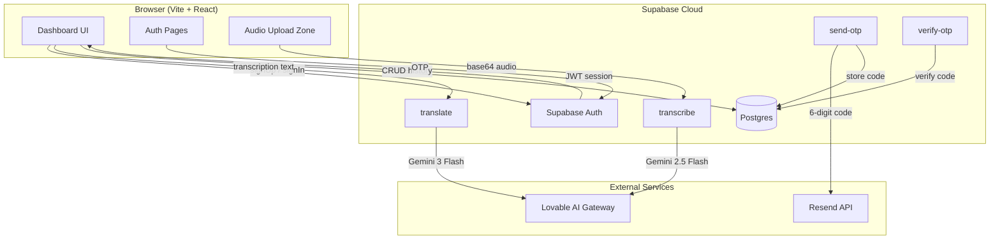

# Devowl Transcriptor — Project Documentation

> **AI-powered audio transcription and translation** — upload any audio file and get a high-accuracy transcription plus a fluent English translation in seconds.

---

## Table of Contents

1. [Overview](#overview)
2. [Features](#features)
3. [Tech Stack](#tech-stack)
4. [Architecture](#architecture)
5. [Project Structure](#project-structure)
6. [User Flows](#user-flows)
7. [Authentication](#authentication)
8. [Database Schema](#database-schema)
9. [Edge Functions (Backend API)](#edge-functions-backend-api)
10. [Frontend Components](#frontend-components)
11. [Routes](#routes)
12. [Environment Variables](#environment-variables)
13. [Local Development](#local-development)
14. [Deployment & Operations](#deployment--operations)
15. [Testing](#testing)
16. [Audio File Requirements](#audio-file-requirements)

---

## Overview

**Devowl Transcriptor** (repository: `speak-translate`) is a full-stack web application that lets authenticated users:

- Upload audio files in common formats (MP3, WAV, M4A, OGG, FLAC, WebM)
- Receive an **accurate transcription** in the original spoken language
- Receive a **fluent English translation** (or a grammar cleanup if the audio was already in English)
- **Browse, revisit, and delete** past transcriptions from a personal history sidebar

The app is built as a **Vite + React** single-page application with **Supabase** for auth, database, and serverless edge functions. AI processing runs through the **Lovable AI Gateway** (Google Gemini models).

---

## Features

| Feature | Description |
|---------|-------------|
| Audio upload | Drag-and-drop or file picker with client-side validation (type, 25 MB max) |
| Transcription | Gemini 2.5 Flash multimodal model via `transcribe` edge function |
| Translation | Gemini 3 Flash via `translate` edge function |
| Language detection | Parsed from AI output tag `[Language: …]` |
| History | Last 50 transcriptions per user, stored in Postgres with RLS |
| Copy & download | Copy transcription/translation; download combined `.txt` |
| Authentication | Email/password signup & login, OTP sign-in, password reset |
| Protected dashboard | Main app requires an active Supabase session |

---

## Tech Stack

### Frontend

| Technology | Purpose |
|------------|---------|
| **React 18** | UI framework |
| **TypeScript** | Type safety |
| **Vite 5** | Build tool & dev server (port 8080) |
| **React Router 6** | Client-side routing |
| **TanStack Query** | Server state (configured, used for future data fetching) |
| **Tailwind CSS** | Styling |
| **shadcn/ui** | Component library (Radix UI primitives) |
| **Lucide React** | Icons |
| **Zod + React Hook Form** | Form validation (available in stack) |
| **Sonner + Radix Toast** | Notifications |

### Backend

| Technology | Purpose |
|------------|---------|
| **Supabase** | Auth, Postgres, Edge Functions |
| **Deno** | Edge function runtime |
| **Lovable AI Gateway** | AI transcription & translation |
| **Resend** | OTP email delivery (custom `send-otp` function) |

### DevOps

| Technology | Purpose |
|------------|---------|
| **Vercel** | Frontend hosting + `/api/keep-alive` serverless route |
| **GitHub Actions** | Daily Supabase keep-alive ping |
| **Vitest** | Unit testing |
| **ESLint** | Linting |

---

## Architecture



### Processing Pipeline

When a user uploads an audio file:

1. **Validate** — Client checks MIME type/extension and 25 MB size limit
2. **Encode** — File is converted to base64 in the browser
3. **Transcribe** — `transcribe` edge function sends audio to Gemini; response includes `[Language: X]` tag
4. **Parse** — Frontend strips language tag and stores detected language
5. **Translate** — `translate` edge function produces fluent English (or cleanup for English source)
6. **Persist** — Record inserted into `transcriptions` table
7. **Display** — Side-by-side original transcription and English translation

---

## Project Structure

```
speak-translate/
├── api/
│   └── keep-alive.ts          # Vercel serverless health check
├── public/
│   ├── owl-favicon.svg        # App favicon
│   └── robots.txt
├── src/
│   ├── components/
│   │   ├── ui/                # shadcn/ui primitives (40+ components)
│   │   ├── AudioUploadZone.tsx
│   │   ├── HistorySidebar.tsx
│   │   ├── ProcessingStatus.tsx
│   │   ├── ResultsPane.tsx
│   │   ├── PasswordInput.tsx
│   │   ├── ProtectedRoute.tsx
│   │   └── ...
│   ├── contexts/
│   │   └── AuthContext.tsx    # Global auth state
│   ├── hooks/
│   │   ├── use-toast.ts
│   │   └── use-mobile.tsx
│   ├── integrations/supabase/
│   │   ├── client.ts          # Supabase client singleton
│   │   └── types.ts           # Generated DB types
│   ├── lib/
│   │   ├── audio-utils.ts     # Validation & base64 encoding
│   │   └── utils.ts           # cn() helper
│   ├── pages/
│   │   ├── Index.tsx          # Main dashboard (protected)
│   │   ├── Login.tsx
│   │   ├── Signup.tsx
│   │   ├── VerifyOTP.tsx
│   │   ├── ForgotPassword.tsx
│   │   ├── ResetPassword.tsx
│   │   └── NotFound.tsx
│   ├── test/
│   │   └── example.test.ts
│   ├── App.tsx                # Routes & providers
│   └── main.tsx               # Entry point
├── supabase/
│   ├── config.toml            # Supabase project config
│   ├── functions/
│   │   ├── transcribe/index.ts
│   │   ├── translate/index.ts
│   │   ├── send-otp/index.ts
│   │   └── verify-otp/index.ts
│   ├── migrations/            # SQL schema migrations
│   └── templates/             # Auth email HTML templates
├── .github/workflows/
│   └── keep-alive.yml         # Daily Supabase ping
├── index.html
├── package.json
├── vite.config.ts
├── tailwind.config.ts
├── vitest.config.ts
└── README.md
```

---

## User Flows

### New User Signup

1. Visit `/signup` → enter name, email, password
2. `supabase.auth.signUp()` creates account
3. Profile auto-created via DB trigger `handle_new_user`
4. Redirected to `/` (dashboard)

### Login

1. Visit `/login` → email + password
2. `supabase.auth.signInWithPassword()`
3. Session stored in `localStorage`; redirect to `/`

### OTP Login (alternative)

1. Visit `/verify-otp` → enter email
2. `supabase.auth.signInWithOtp()` sends 6-digit code
3. User enters code → `supabase.auth.verifyOtp()`
4. Redirected to `/`

### Password Reset

1. `/forgot-password` → `resetPasswordForEmail()` with redirect to `/reset-password`
2. User follows email link and sets new password on `/reset-password`

### Transcribe Audio

1. Authenticated user on `/` uploads audio
2. Progress UI: Uploading → Transcribing → Translating → Done
3. Results shown in two-column layout
4. Entry appears in history sidebar

### History Management

- Click any history item to reload its transcription/translation
- Hover → trash icon to delete
- **New Transcription** button resets to upload state

---

## Authentication

| Mechanism | Implementation |
|-----------|----------------|
| Session storage | `localStorage` via Supabase client |
| Protected routes | `ProtectedRoute` wrapper redirects unauthenticated users to `/login` |
| Auth context | `AuthProvider` exposes `user`, `session`, `loading`, `signOut` |
| Custom OTP (edge) | `send-otp` / `verify-otp` functions + `email_verifications` table (also Supabase native OTP on `/verify-otp`) |
| Email templates | Custom HTML in `supabase/templates/` for confirmation, recovery, magic link |

**Edge function JWT:** All four edge functions have `verify_jwt = false` in `config.toml` (publicly invokable; rely on Supabase anon key from client).

---

## Database Schema

### `profiles`

| Column | Type | Notes |
|--------|------|-------|
| `id` | UUID | Primary key |
| `user_id` | UUID | FK → `auth.users`, unique |
| `display_name` | TEXT | From signup metadata or email |
| `avatar_url` | TEXT | Optional |
| `created_at` | TIMESTAMPTZ | |
| `updated_at` | TIMESTAMPTZ | Auto-updated via trigger |

**RLS:** Users can SELECT/INSERT/UPDATE only their own row.

**Trigger:** `on_auth_user_created` auto-inserts profile on signup.

---

### `transcriptions`

| Column | Type | Notes |
|--------|------|-------|
| `id` | UUID | Primary key |
| `user_id` | UUID | FK → `auth.users` |
| `file_name` | TEXT | Original upload filename |
| `detected_language` | TEXT | e.g. "Spanish", "English" |
| `transcription` | TEXT | Original-language text |
| `translation` | TEXT | English output |
| `is_english` | BOOLEAN | True if source was English |
| `created_at` | TIMESTAMPTZ | |

**RLS:** Users can SELECT, INSERT, DELETE own rows only (no UPDATE policy).

**Indexes:** `user_id`, `created_at DESC`

---

### `email_verifications`

| Column | Type | Notes |
|--------|------|-------|
| `id` | UUID | Primary key |
| `email` | TEXT | |
| `code` | TEXT | 6-digit OTP |
| `expires_at` | TIMESTAMPTZ | 10-minute expiry |
| `verified` | BOOLEAN | Default false |
| `created_at` | TIMESTAMPTZ | |

**RLS:** Blocked for all client access (`USING (false)`). Only service-role edge functions can read/write.

---

## Edge Functions (Backend API)

### `transcribe`

**Input:**
```json
{
  "audioBase64": "<base64 string>",
  "mimeType": "audio/mpeg",
  "fileName": "recording.mp3"
}
```

**Output:**
```json
{ "transcription": "[Language: Spanish]\n\nHola mundo..." }
```

**AI model:** `google/gemini-2.5-flash` (multimodal audio input)

**Errors:** 400 (missing data), 429 (rate limit), 402 (credits), 500

---

### `translate`

**Input:**
```json
{
  "text": "transcription text",
  "detectedLanguage": "Spanish"
}
```

**Output:**
```json
{
  "translation": "Hello world...",
  "isEnglish": false
}
```

**AI model:** `google/gemini-3-flash-preview`

---

### `send-otp`

**Input:** `{ "email": "user@example.com" }`

**Behavior:**
1. Generates random 6-digit code
2. Deletes old codes for that email
3. Inserts into `email_verifications` (10 min expiry)
4. Sends HTML email via Resend API

**Output:** `{ "success": true }`

---

### `verify-otp`

**Input:** `{ "email": "user@example.com", "code": "123456" }`

**Behavior:**
1. Looks up matching unverified, non-expired code
2. Marks verified and deletes all codes for email

**Output:** `{ "success": true, "verified": true }`

---

## Frontend Components

| Component | Responsibility |
|-----------|----------------|
| `AudioUploadZone` | Drag-drop / click upload, file validation display |
| `ProcessingStatus` | Step indicator: Uploading → Transcribing → Translating → Done |
| `ResultsPane` | Two-column cards with copy & download actions |
| `HistorySidebar` | Collapsible sidebar with history list, delete, new transcription |
| `ProtectedRoute` | Auth gate with loading spinner |
| `PasswordInput` | Password field with visibility toggle |

---

## Routes

| Path | Component | Auth Required |
|------|-----------|---------------|
| `/` | `Index` (dashboard) | Yes |
| `/login` | `Login` | No |
| `/signup` | `Signup` | No |
| `/verify-otp` | `VerifyOTP` | No |
| `/forgot-password` | `ForgotPassword` | No |
| `/reset-password` | `ResetPassword` | No |
| `*` | `NotFound` | No |

---

## Environment Variables

### Frontend (`.env` in project root)

```env
VITE_SUPABASE_URL=https://your-project.supabase.co
VITE_SUPABASE_PUBLISHABLE_KEY=your_supabase_anon_key
```

> The Supabase client throws at startup if either variable is missing.

### Supabase Edge Function Secrets

Set in the Supabase dashboard (Project → Edge Functions → Secrets):

| Secret | Used By |
|--------|---------|
| `LOVABLE_API_KEY` | `transcribe`, `translate` |
| `RESEND_API_KEY` | `send-otp` |
| `SUPABASE_URL` | `send-otp`, `verify-otp` (auto-injected) |
| `SUPABASE_SERVICE_ROLE_KEY` | `send-otp`, `verify-otp` (auto-injected) |

### Vercel / GitHub Actions

| Variable | Purpose |
|----------|---------|
| `VITE_SUPABASE_URL` / `SUPABASE_URL` | Keep-alive API route |
| `VITE_SUPABASE_ANON_KEY` / `SUPABASE_ANON_KEY` | Keep-alive & GitHub workflow |
| `SUPABASE_ANON_KEY` (GitHub secret) | Daily cron ping |

---

## Local Development

### Prerequisites

- **Node.js** 18+ (or **Bun** — `bun.lockb` present)
- Supabase project with migrations applied
- Edge function secrets configured

### Commands

```bash
# Install dependencies
npm install

# Start dev server (http://localhost:8080)
npm run dev

# Production build
npm run build

# Preview production build
npm run preview

# Lint
npm run lint

# Run tests
npm run test

# Watch tests
npm run test:watch
```

### Path Alias

`@/` resolves to `src/` (configured in `vite.config.ts` and `tsconfig`).

---

## Deployment & Operations

### Frontend (Vercel)

- Build command: `npm run build`
- Output: `dist/`
- Serverless route: `GET /api/keep-alive` — pings Supabase `profiles` table

### Supabase

- **Project ID:** `zcgvrmvyncetjvoinysv` (from `config.toml`)
- Deploy edge functions: `supabase functions deploy`
- Apply migrations: `supabase db push`

### Keep-Alive (Free Tier)

Supabase free projects pause after inactivity. Two mechanisms prevent this:

1. **GitHub Actions** — `.github/workflows/keep-alive.yml` runs daily at 12:00 UTC
2. **Vercel API** — `api/keep-alive.ts` optional manual/cron ping

---

## Testing

- **Framework:** Vitest + Testing Library + jsdom
- **Config:** `vitest.config.ts`
- **Setup:** `src/test/setup.ts`
- **Example:** `src/test/example.test.ts`

Run with `npm run test`.

---

## Audio File Requirements

| Constraint | Value |
|------------|-------|
| **Max size** | 25 MB |
| **Formats** | MP3, WAV, M4A, OGG, FLAC, WebM |
| **MIME types** | `audio/mpeg`, `audio/wav`, `audio/x-wav`, `audio/mp4`, `audio/x-m4a`, `audio/ogg`, `audio/flac`, `audio/webm` |
| **Encoding** | Base64 (data URL prefix stripped before API call) |

Validation logic lives in `src/lib/audio-utils.ts`.

---

## AI Prompts (Summary)

### Transcription System Prompt

Expert audio transcription assistant. Preserve original language, proper punctuation, paragraph breaks. Start with `[Language: <detected language>]` then transcription only — no commentary.

### Translation System Prompt

Expert translator. Translate to fluent English or clean up if already English. Fix grammar and punctuation. Return **only** the translated/cleaned text.

---

## Security Notes

- **Row Level Security (RLS)** enforced on all user-facing tables
- `email_verifications` blocked from direct client access
- Edge functions use CORS `Access-Control-Allow-Origin: *`
- JWT verification disabled on edge functions — consider enabling for production hardening
- Never commit `.env` files with real keys (see `.gitignore`)

---

## Branding

- **App name:** Devowl Transcriptor
- **Favicon:** Owl (`/owl-favicon.svg`, `/owl-favicon.png`)
- **Tagline:** *Upload any audio file — get an accurate transcription and English translation in seconds.*

---

*Last updated: May 2026*
