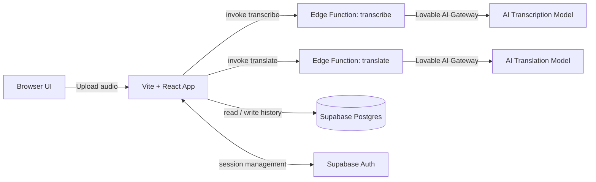

# Devowl Transcriptor

> AI-powered audio transcription and translation — upload any audio file and get a high-accuracy transcription plus a fluent English translation in seconds.


---

## Overview

**Devowl Transcriptor** is a full-stack web application that allows authenticated users to:

- Upload any audio file and receive an **accurate transcription** in the original spoken language
- Get a **fluent English translation** of the transcription (or an English cleanup pass if the audio was already in English)
- **Review and manage history** — all transcriptions are saved per user and can be revisited or deleted at any time

---

## Features

| Feature | Description |
|---|---|
| 🎙️ Audio Upload | Client-side validation and base64 encoding before sending to backend |
| 📝 Transcription | Powered by the Lovable AI Gateway via a Supabase Edge Function |
| 🌐 Translation | Separate Edge Function produces fluent English output |
| 🗂️ History | All results are persisted in Postgres and accessible from the dashboard |
| 🔐 Authentication | OTP-based email verification; dashboard is protected (auth required) |

---

## Architecture



---

## Project Structure

### Supabase Database (Migrations in `supabase/migrations/`)

| Table | Purpose |
|---|---|
| `profiles` | Stores user profile data |
| `transcriptions` | Saves transcription and translation history per user |
| `email_verifications` | Supports the OTP email verification flow |

### Supabase Edge Functions (`supabase/functions/`)

| Function | Input | Output |
|---|---|---|
| `transcribe` | `{ audioBase64, mimeType, fileName }` | `{ transcription }` |
| `translate` | `{ text, detectedLanguage }` | `{ translation, isEnglish }` |
| `send-otp` | User email | Sends OTP via Resend |
| `verify-otp` | OTP token | Verifies and authenticates user |

---

## Environment Variables

### Frontend (Vite)

Create a `.env` file in the root directory:

```env
VITE_SUPABASE_URL=your_supabase_project_url
VITE_SUPABASE_PUBLISHABLE_KEY=your_supabase_anon_key
```

### Supabase Edge Functions

Set these secrets in your Supabase project dashboard (not in the frontend):